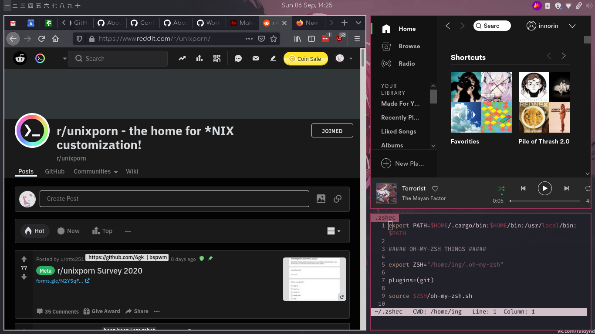
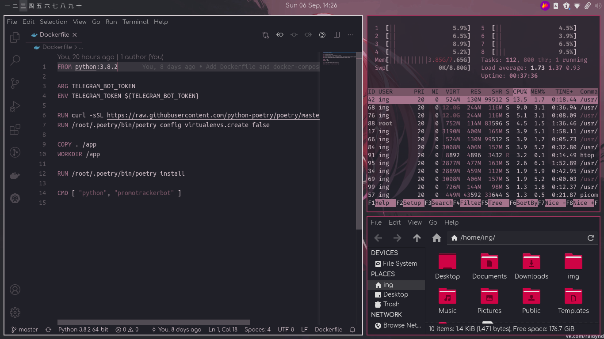
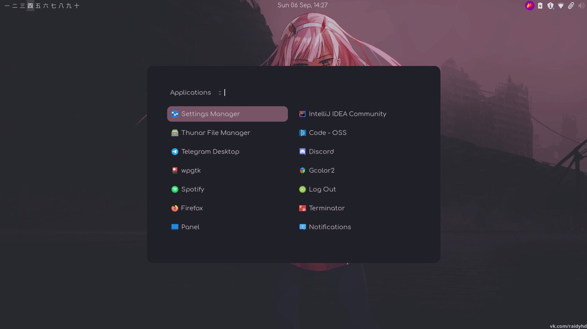

## Screenshots

## Details
* **WM**: Bspwm;
* **DE**: Xfce;
* **OS**: Manjaro;
* **Wallpaper**: [Zero Two](https://wallpapercave.com/w/wp5982004);
* **Color scheme**: [Zero Two with more colors](https://wallpapercave.com/w/wp5523443);
* **Shell**: ZSH + [Oh My Zsh](https://github.com/ohmyzsh/ohmyzsh) + [Starship Prompt](https://github.com/starship/starship);
* **Color script**: [Panes](https://github.com/FlorianHeydrich/ColorScripts);
* **Terminal**: Terminator;
* **Bar**: Xfce-panel;
* **Editor**: VsCode with [Wal Theme](https://github.com/dlasagno/vscode-wal-theme) + Vim wih [Wal Theme](https://github.com/dylanaraps/wal.vim) + Emacs;
* **Launcher and menus**: Rofi with custom theme based on [this](https://github.com/adi1090x/rofi);
* **Chat**: Telegram with [Wal theme](https://github.com/agnipau/telegram-palette-gen);
* **GTK theme and icons**: [Euphoria](https://github.com/windozz/dotfiles);
* **File Manager**: Thunar;
* **Browser**: Firefox;
* **Music player**: Spotify.

## Useful links
[Manage dotfiles with git bare](https://news.ycombinator.com/item?id=11070797)

[Dotfiles page on ArchWiki](https://wiki.archlinux.org/index.php/Dotfiles)

[XFCE + BSPWM setup](https://bgdawes.github.io/bspwm-xfce-dotfiles/)

[Mute button not working](https://wiki.archlinux.org/index.php/ThinkPad_mute_button)
