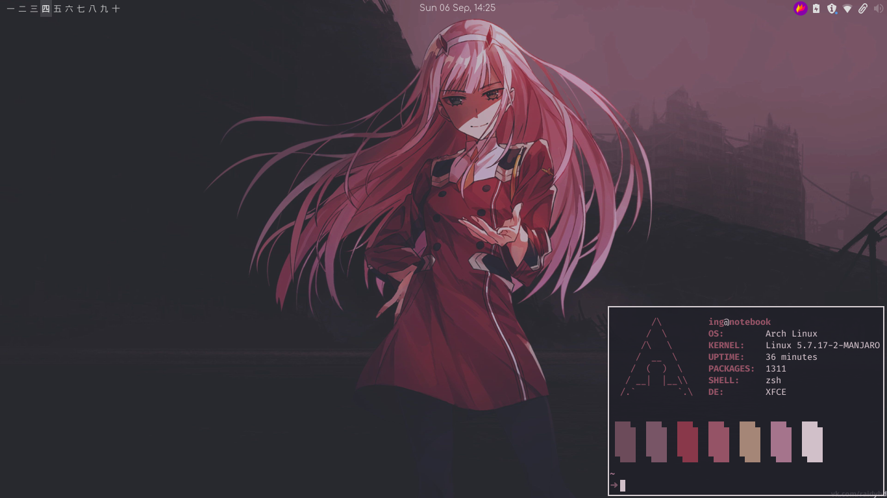

# Dotfiles!

## Screenshots

## Useful links
[Manage dotfiles with git bare](https://news.ycombinator.com/item?id=11070797)

[Dotfiles page on ArchWiki](https://wiki.archlinux.org/index.php/Dotfiles)

[Mute button not working](https://wiki.archlinux.org/index.php/ThinkPad_mute_button)

## Credits
[GTK Theme and Icons](https://github.com/windozz/dotfiles)
[Color scripts](https://github.com/FlorianHeydrich/ColorScripts)
